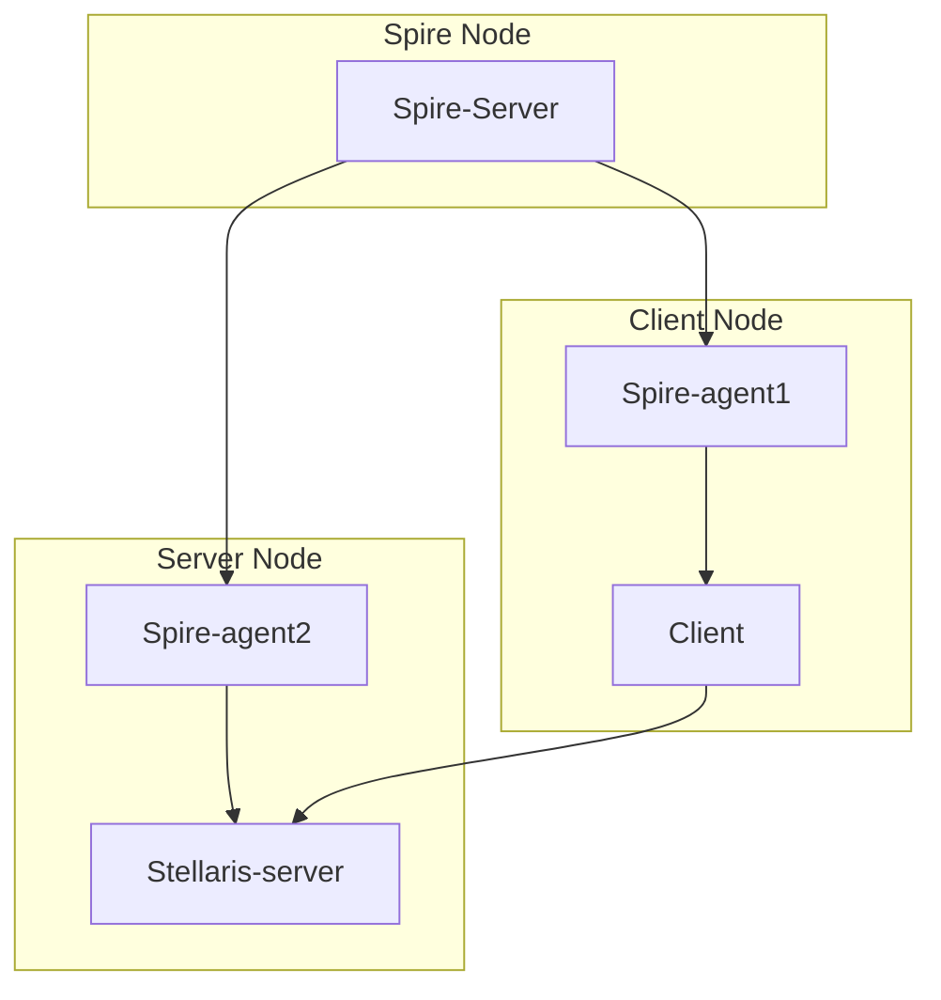

# Stellaris

## :heavy_exclamation_mark: Prerequirements
- 8 GB RAM
- 6 VCPUs

## :bookmark: Requirements
- [Docker](https://docs.docker.com/engine/install/ubuntu/) 
- [Kubectl](https://kubernetes.io/docs/tasks/tools/install-kubectl-linux/)
- [Minikube](https://minikube.sigs.k8s.io/docs/start/)

## :clipboard: Flowchart


## :triangular_flag_on_post: Starting

```bash
# Clone repository
git clone https://github.com/arielroque/stellaris.git

# Go to stellaris
cd stellaris
```

## :building_construction: Deploy Demo 

```bash
# Create minikube cluster
./demo.sh --create-minikube-cluster

# Deploy Stellaris demo
./demo.sh --deploy

# See another Commands:
# ./demo.sh --help
```

## :rowboat: Browse the Demo

```bash
# Open port to access the client
kubectl port-forward client-api-0 -n client 8080:8080
```
Open in your browser: [localhost:8080/dashboard](http://localhost:8080/dashboard)

## :mag: Does SPIFFE/SPIRE really work?

```bash
# Delete SPIRE Agents
./demo.sh --delete-spire-agents

# List pods in SPIRE namespace
# kubectl get pods -n spire
```

[show image]

```bash
# Get logs from client API
kubectl logs client-api-0 -n client
```

```bash
# Get logs from stellaris API
kubectl logs stellaris-api-0 -n server
```

```bash
./demo.sh --deploy-spire-agents
```
[show image]

## :arrow_left: Uninstall

```bash
# Cleanup demo
./demo.sh --cleanup-demo

# Delete cluster
./demo.sh --delete-minikube-cluster
```
