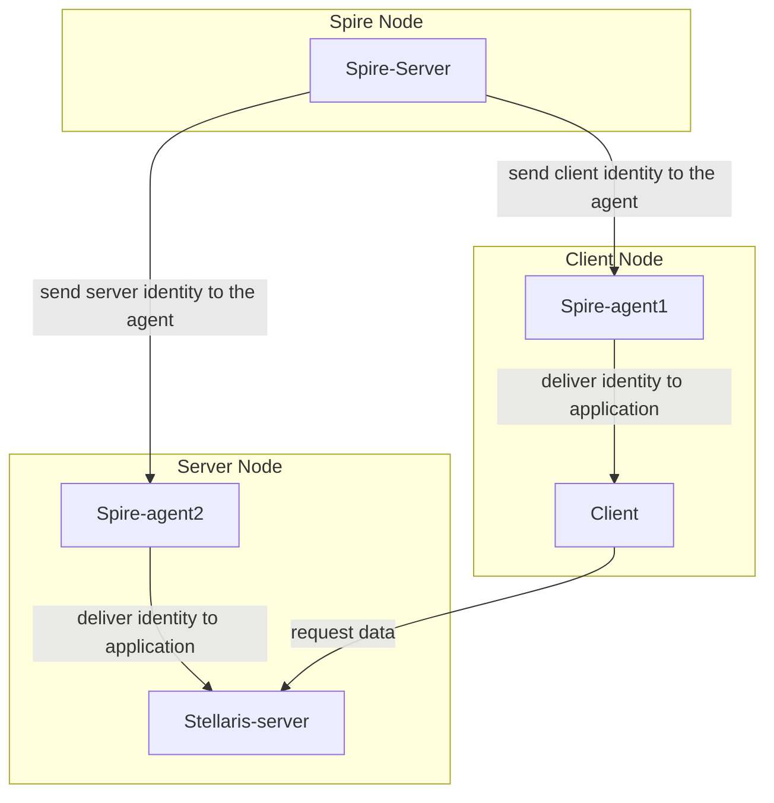

# Stellaris

## :heavy_exclamation_mark: Prerequirements
- 8 GB RAM
- 6 VCPUs

## :bookmark: Requirements
- [Docker](https://docs.docker.com/engine/install/ubuntu/) 
- [Kubectl](https://kubernetes.io/docs/tasks/tools/install-kubectl-linux/)
- [Minikube](https://minikube.sigs.k8s.io/docs/start/)

## :clipboard: Flowchart


## :triangular_flag_on_post: Starting

```bash
# Clone repository
git clone https://github.com/arielroque/stellaris.git

# Go to stellaris
cd stellaris
```

## :building_construction: Deploy Demo 
Now, we will deploy the Stellaris demo in a Minikube cluster

```bash
# Create minikube cluster
./demo.sh --create-minikube-cluster

# Deploy Stellaris demo
./demo.sh --deploy

# See another Commands:
# ./demo.sh --help
```

## :rowboat: Browse the Demo

Since we have the applications running, we can open the browser to see the workflow. 

```bash
# Open port to access the client
kubectl port-forward client-api-0 -n client 8080:8080
```
Open in your browser: [localhost:8080/dashboard](http://localhost:8080/dashboard)

## :mag: Does SPIFFE/SPIRE really work?

We deployed the applications, and the identities are continuously created by the SPIRE Server every 60s. Is possible after the application is already running, kill the SPIRE agents and keep everything working? Let`s try it  

```bash
# Delete SPIRE Agents
./demo.sh --delete-spire-agents

# List pods in SPIRE namespace
# kubectl get pods -n spire
```
Let`s wait 60s to check if something changes...

[show image]

As we can see, the application is not working well... we lost the connection with the server. We can check the logs in the Client and Server to try understand the problem

```bash
# Get logs from client API
kubectl logs client-api-0 -n client
```

```bash
# Get logs from stellaris API
kubectl logs stellaris-api-0 -n server
```
The certificates as expected are not valid anymore and the connection is not allowed. Let's deploy the SPIRE agents again to solve this problem.

```bash
./demo.sh --deploy-spire-agents
```
We need to wait 1-2 minutes and we are back on track.
[show image]

## :arrow_left: Uninstall

To uninstall the demo and the cluster you can use the following commands

```bash
# Cleanup demo
./demo.sh --cleanup-demo

# Delete cluster
./demo.sh --delete-minikube-cluster
```
