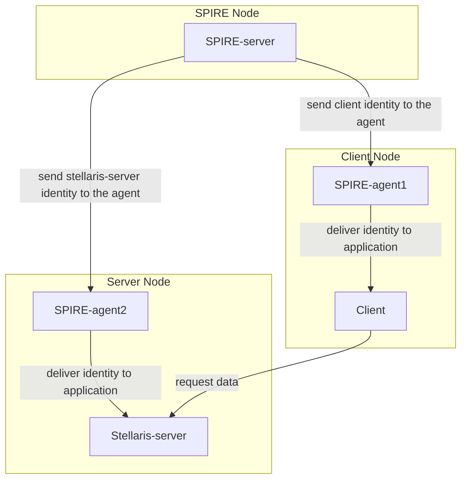
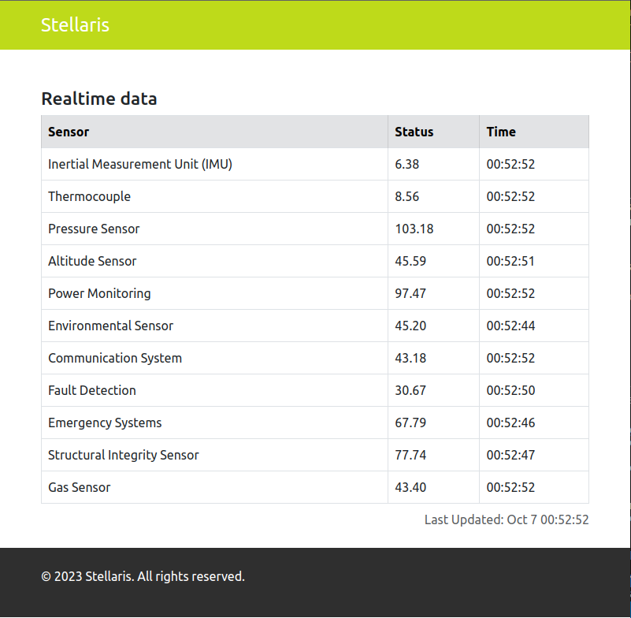
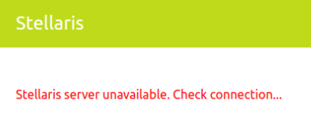

&nbsp;&nbsp;
&nbsp;&nbsp;
&nbsp;&nbsp; 


## :heavy_exclamation_mark: Prerequirements
- 8 GB RAM
- 6 VCPUs

## :bookmark: Requirements
- [Docker](https://docs.docker.com/engine/install/ubuntu/) 
- [Kubectl](https://kubernetes.io/docs/tasks/tools/install-kubectl-linux/)
- [Minikube](https://minikube.sigs.k8s.io/docs/start/)

## :books: SPIRE
[SPIRE](https://spiffe.io/) is a production-ready implementation of the [SPIFFE](https://spiffe.io/docs/latest/spiffe-about/overview/) APIs that performs node and workload attestation in order to securely issue SVIDs to workloads, and verify the SVIDs of other workloads, based on a predefined set of conditions. 

The tool has two major components: the server and the agent. The server
is responsible for authenticating agents and minting SVIDs, while the agent is responsible for serving the SPIFFE Workload API. Both components are written using a plugin-oriented architecture so they
can easily be extended to adapt to a vast array of different configurations and platforms.

Some use cases where SPIRE can help:

 - **Zero Trust Security**: SPIRE enables organizations to implement a zero-trust security model in their distributed environments. It ensures that every workload, regardless of where it runs, has a verifiable and authenticated identity

 - **Multi-Cloud and Hybrid Environments**: SPIRE is well-suited for organizations with workloads distributed across multiple cloud providers or in hybrid environments. It provides a consistent way to manage identities across diverse infrastructures

 - **Microservices and Container Orchestration**: SPIRE works seamlessly with container orchestrators like Kubernetes, making it suitable for microservices-based architectures where workloads are frequently created, scaled, and destroyed

 - **Security and Compliance**: SPIRE helps organizations meet security and compliance requirements by enforcing strong identity and access controls, tracking workload activity, and enabling audit trails

 - **Dynamic Environments**: SPIRE's ability to dynamically rotate credentials and attest workloads is essential for maintaining security and trust in environments with frequent changes

## :clipboard: Motivational problem
We have a front-end application that needs to communicate with a back-end API deployed on the other side of the world to get sensitive information about a rocket launched into space. We don't want this information to fall into the wrong hands :clown_face: , so it is extremely important to ensure that only the correct front-end can communicate. One way of doing this is using SPIRE :rocket:

In our demo, we will have 3 isolated environments (nodes), one to the SPIRE server, another to the front-end (client) together with its SPIRE agent, and finally, another for back-end API (stellaris-server) together with its SPIRE agent. We create the SPIRE entries for the front-end and back-end to match with the desired selector and finally restrict to accept only connections that contain the SPIFFE ID from the client

The figure below shows the demo flow:



## :triangular_flag_on_post: Starting
Let's start by cloning the repository

```bash
# Clone repository
git clone https://github.com/arielroque/stellaris.git

# Go to stellaris
cd stellaris
```

## :tv: Demo 
Now, we will deploy the Stellaris demo in a Minikube cluster. Run the following command:

```bash
# Create minikube cluster
./demo.sh --create-minikube-cluster

# Deploy Stellaris demo
./demo.sh --deploy

# See another commands:
# ./demo.sh --help
```

## :rowboat: Browse the Demo
Since we have the applications running, we can open the browser to see the workflow. 

```bash
# Open port to access the client
kubectl port-forward client-api-0 -n client 8080:8080 &
```
Open in your browser: [localhost:8080/dashboard](http://localhost:8080/dashboard)



## :mag: Does SPIRE really work?
We deployed the applications, and the identities are continuously created by the SPIRE Server every 60s. Is possible after the application is already running, kill the SPIRE agents and keep everything working? Let`s try it  

```bash
# Delete SPIRE Agents
./demo.sh --delete-spire-agents

# List pods in SPIRE namespace
# kubectl get pods -n spire
```
Let`s wait 60s to check if something changes...



As we can see, the application is not working well... we lost the connection with the server. We can check the logs in the Client and Server to try to understand the problem

```bash
# Get logs from client
kubectl logs client-api-0 -n client
```
For client, we have something like this:

```bash
2023/10/07 01:04:21 Error getting data: Get "https://stellaris-api.server:8090/dashboard": x509svid: could not verify leaf certificate: x509: certificate has expired or is not yet valid: current time 2023-10-07T01:04:21Z is after 2023-10-07T00:56:17Z
2023/10/07 01:04:23 Error getting data: Get "https://stellaris-api.server:8090/dashboard": x509svid: could not verify leaf certificate: x509: certificate has expired or is not yet valid: current time 2023-10-07T01:04:23Z is after 2023-10-07T00:56:17Z
```

```bash
# Get logs from stellaris API
kubectl logs stellaris-api-0 -n server
```

For stellaris-server we have something like this:

```bash
2023/10/08 02:13:58 http: TLS handshake error from 10.244.1.2:37764: remote error: tls: bad certificate
2023/10/08 02:13:59 http: TLS handshake error from 10.244.1.2:37780: remote error: tls: bad certificate
2023/10/08 02:14:00 http: TLS handshake error from 10.244.1.2:45494: remote error: tls: bad certificate

```

The certificates as expected are not valid anymore and the connection is not allowed. Let's deploy the SPIRE agents again to solve this problem.

```bash
./demo.sh --deploy-spire-agents
```
We need to wait 1-2 minutes and we are back on track :rocket: 

## :arrow_left: Uninstall

To uninstall the demo and the cluster you can use the following commands

```bash
# Cleanup demo
./demo.sh --cleanup-demo

# Delete cluster
./demo.sh --delete-minikube-cluster
```
## :rocket: Contributing

Pull request are also welcome , please read  [CONTRIBUTING.md](/CONTRIBUTING.md)  for details on our code of conduct, and the process for submitting pull requests to us.
    
-   Check  [issue templates](https://github.com/arielroque/stellaris/issues)  for the suggested issue formats
