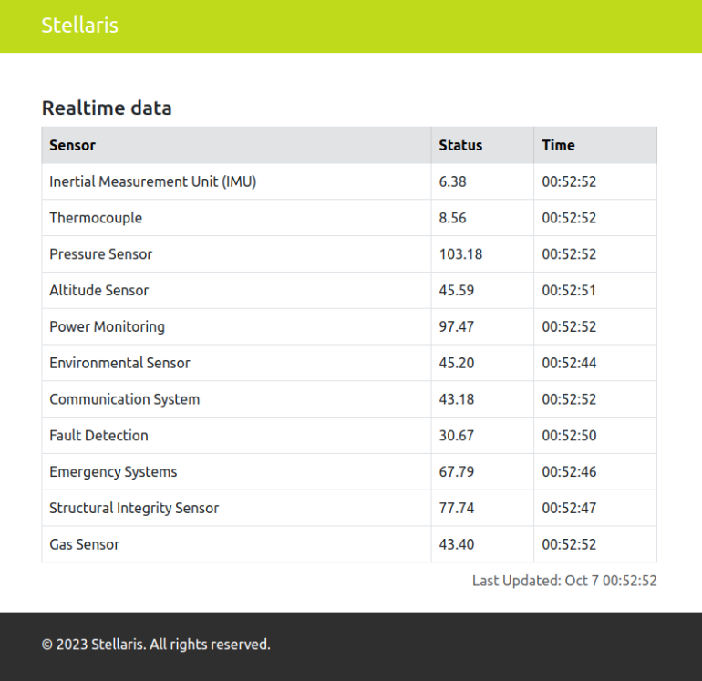

## :heavy_exclamation_mark: Prerequirements
- 8 GB RAM
- 6 VCPUs

## :bookmark: Requirements
- [Docker](https://docs.docker.com/engine/install/ubuntu/) 
- [Kubectl](https://kubernetes.io/docs/tasks/tools/install-kubectl-linux/)
- [Minikube](https://minikube.sigs.k8s.io/docs/start/)

## :clipboard: Flowchart


## :triangular_flag_on_post: Starting

```bash
# Clone repository
git clone https://github.com/arielroque/stellaris.git

# Go to stellaris
cd stellaris
```

## :building_construction: Deploy Demo 
Now, we will deploy the Stellaris demo in a Minikube cluster

```bash
# Create minikube cluster
./demo.sh --create-minikube-cluster

# Deploy Stellaris demo
./demo.sh --deploy

# See another Commands:
# ./demo.sh --help
```

## :rowboat: Browse the Demo

Since we have the applications running, we can open the browser to see the workflow. 

```bash
# Open port to access the client
kubectl port-forward client-api-0 -n client 8080:8080
```
Open in your browser: [localhost:8080/dashboard](http://localhost:8080/dashboard)



## :mag: Does SPIFFE/SPIRE really work?

### Try to get information from a server using another client
The idea here is to try to communicate with the server that has secret information using another client that does not have an identity

```bash
# Open port to access the server
kubectl port-forward stellaris-api-0 -n server 8090:8090
```
Since the connection between the client and server is TLS, let's try to communicate by skipping the identity

```
# Make a request http using curl client
curl https://localhost:8090 -k
...
curl: (60) SSL certificate problem: unable to get local issuer certificate
More details here: https://curl.haxx.se/docs/sslcerts.html

curl failed to verify the legitimacy of the server and therefore could not
establish a secure connection to it. To learn more about this situation and
how to fix it, please visit the web page mentioned above.
```
The connection requires mutual TLS which means a valid client identity to establish communication. We can see that looking in server logs

```bash
2023/09/06 00:33:35 Service waiting for an X.509 SVID...
2023/09/06 00:33:36 Service waiting for a trust bundle...
2023/09/06 00:33:36 Stellaris service listening on port 8090...
2023/09/06 02:49:53 http: TLS handshake error from 127.0.0.1:52236: tls: client didn't provide a certificate
```

### Kill Spire-agents
We deployed the applications, and the identities are continuously created by the SPIRE Server every 60s. Is possible after the application is already running, kill the SPIRE agents and keep everything working? Let`s try it  

```bash
# Delete SPIRE Agents
./demo.sh --delete-spire-agents

# List pods in SPIRE namespace
# kubectl get pods -n spire
```
Let`s wait 60s to check if something changes...


As we can see, the application is not working well... we lost the connection with the server. We can check the logs in the Client and Server to try understand the problem

```bash
# Get logs from client API
kubectl logs client-api-0 -n client
```

```bash
2023/10/07 01:04:21 Error getting data: Get "https://stellaris-api.server:8090/dashboard": x509svid: could not verify leaf certificate: x509: certificate has expired or is not yet valid: current time 2023-10-07T01:04:21Z is after 2023-10-07T00:56:17Z
2023/10/07 01:04:23 Error getting data: Get "https://stellaris-api.server:8090/dashboard": x509svid: could not verify leaf certificate: x509: certificate has expired or is not yet valid: current time 2023-10-07T01:04:23Z is after 2023-10-07T00:56:17Z
```

```bash
# Get logs from stellaris API
kubectl logs stellaris-api-0 -n server
```

```bash
2023/10/07 01:03:01 Error getting data: Get "https://stellaris-api.server:8090/dashboard": x509svid: could not verify leaf certificate: x509: certificate has expired or is not yet valid: current time 2023-10-07T01:03:01Z is after 2023-10-07T00:56:17Z
2023/10/07 01:03:03 Error getting data: Get "https://stellaris-api.server:8090/dashboard": x509svid: could not verify leaf certificate: x509: certificate has expired or is not yet valid: current time 2023-10-07T01:03:03Z is after 2023-10-07T00:56:17Z
```

The certificates as expected are not valid anymore and the connection is not allowed. Let's deploy the SPIRE agents again to solve this problem.

```bash
./demo.sh --deploy-spire-agents
```
We need to wait 1-2 minutes and we are back on track.

## :arrow_left: Uninstall

To uninstall the demo and the cluster you can use the following commands

```bash
# Cleanup demo
./demo.sh --cleanup-demo

# Delete cluster
./demo.sh --delete-minikube-cluster
```
